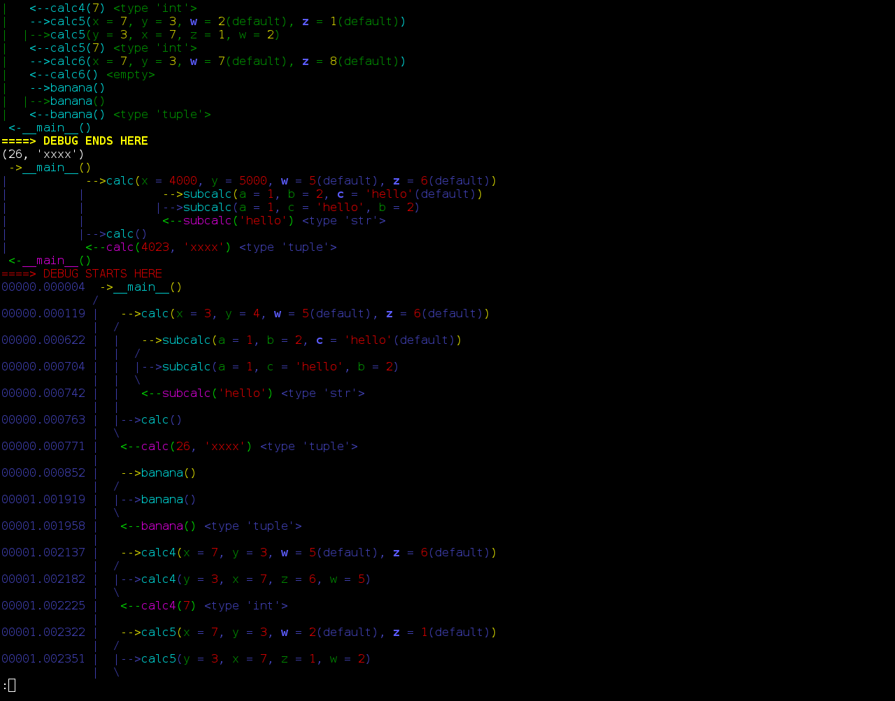

=========
tracehook
=========

tracehook does pretty-printed/ascii-art logging of Python function calls, args,
return-values and pre-return locals() snapshots in realtime. It is small,
non-intrusive, hyper-configurable, and has minimal dependencies. It has been
syntax-tested OK for python ``>= 2.6`` and ``>= 3.1``

The primary focus is on easy-on-the-eye (portable!) colourised output for
quick visual in-terminal tracing of the lifecycle of data passing through the
running program, in contrast to the verbose line-granularity source-debug
output and heavy exported images which most other tracers are designed for.

It requires no auxiliary processes and only requires ``import tracehook`` and a
small decorator above each function you want traced. For maximum
implementation-portability it uses function-wrapping for all but one piece of
functionality (optionally dumping variable-snapshots from within the function
before return, for which it uses ``sys.settrace``), so avoiding ``sys.settrace``
entirely just requires that the decorators be of the form
``@wrap(around=no_around``), which means only the pre- and post- blocks will be
run.

Presently ``@wrap`` accepts the following arguments (unquoted - "compact" is
boolean and the others are function references):

::

    pre     = pre    | no_pre
    around  = around | no_around
    post    = post   | no_post
    compact = True   | False

The {,no_}pre/around/post are references to ready-provided functions, but if
you want to experiment there is nothing stopping you creating your own custom
functions based on those and doing e.g. ``@wrap(pre=my_pre)``

Installation
------------

From source (with dependencies)
~~~~~~~~~~~~~~~~~~~~~~~~~~~~~~~

::

    $ git clone https://github.com/rowanthorpe/tracehook.git
    $ git clone https://github.com/tartley/colorama.git

From latest release tarball (with dependencies)
~~~~~~~~~~~~~~~~~~~~~~~~~~~~~~~~~~~~~~~~~~~~~~~

::

    $ wget -O tracehook-0.3.2.tar.gz https://github.com/rowanthorpe/tracehook/tarball/v0.3.2
    $ wget -O colorama-0.3.3.tar.gz https://github.com/tartley/colorama/tarball/v0.3.3

Usage
~~~~~

There are enough indicative uses in the test.py file that for now the easiest
and quickest explanation is to just look in that file for inspiration.

* The standard approach is to install into a system directory and import from
  there:

.. code:: python

    import tracehook as th

* To just import from a subdir "tracehook" within your project instead (which
  may sometimes be more appropriate for a small tracing hook like this), do the
  following:

.. code:: python

    if __package__:
      from . import tracehook as th
    else:
      import os, sys, inspect
      trc_folder = os.path.realpath(os.path.join(os.path.dirname(
        inspect.getfile(inspect.currentframe())), "tracehook"))
      if trc_folder not in sys.path:
        sys.path.insert(0, trc_folder)
      del trc_folder
      import tracehook as th

* And if the importing subsystem is inexplicably broken for you, use an
  inlining exec (and update global var assignments and callers to e.g. ``pre()``
  instead of ``th.pre()``) as shown below. Add dir to the system path as above,
  then replace the import line with:

.. code:: python

    with open(os.path.join(trc_folder, "__init__.py"), 'r') as fh:
      exec(fh.read())
    del fh

Authors
-------

Rowan Thorpe <rowan@rowanthorpe.com>

License
-------

tracehook uses the GPLv3 license, check COPYING file.

TODO
----

* Add case-handling for using sys.settrace (or equivalents) portably across
  different Python implementations (presently I've only tested it on cpython)

* (nitpick) Use something like argparse to colourise each commandline argv
  exactly, rather than the present heuristic way

Screenshots
-----------

   tracehook test-run screenshot 2015/10/08
